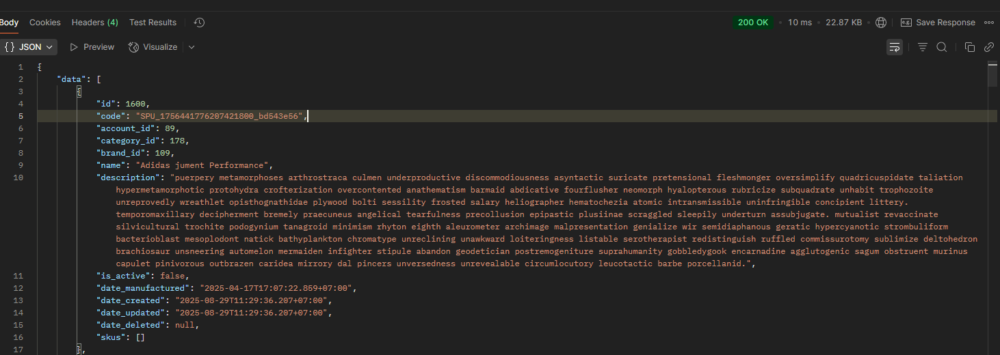
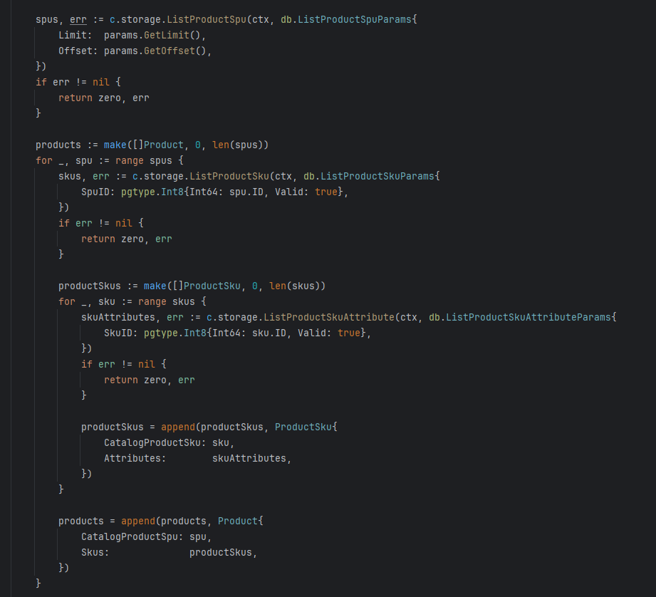
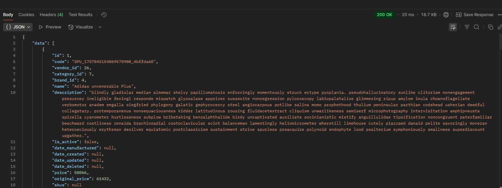

# shopnexus-remastered

[](https://wakatime.com/badge/user/592c97c4-15ad-49cb-ac34-d607be35c524/project/79f8a24e-0fe8-417e-b42b-2009d7a4362f)

## Epic features

### 1. Have two mode: modular monolith and microservices

- Modular monolith: all services in one process -> everything is easy 🤑
- Microservices: each service run its own process -> scaling and independent deployment, but hell for debugging 🥀

## My code, my rules

### Database

- Always use table per type (TPT) in database design
- Audit snapshot for tax authority and transaction dispute purpose
- SearchEngine(search_sync): Query event table to get the latest

### Go

- Folder structure: Vertical slice (by service)
- Use grpc generated code as domain model to reduce mapping code (<https://www.reddit.com/r/golang/comments/rdkqwv/grpc_use_the_generated_proto_as_a_model/>)

### General

- No use orchestration patterns, use choreography instead.
- Use choreography pattern with compensating transactions to handle failures gracefully.
- Always use events to communicate between services to microservice friendly and avoid tight coupling.

#### Early stage

- Use models generated from sqlc as much as possible to coupling data with database schema, easy for development
- Only create custom model for DTOs only (response data) and some custom types that are not directly related to database schema
- #1: Show the id (the incremental primary key) in the DTO to reduce project complexity

#### Later stage

- Use generated protobuf as domain models to decouple from database schema
- Each service is a different binary, so each service can have its own model package
- Add permission checking
- #1: Hide the internal id (the incremental primary key) in the DTO to avoid data leak, use "code" (the unique public identifier) instead for external reference

### Biz

- Tag only for SEO purpose, use category for product grouping instead.
- Handle the problem "Slowly Changing Dimension (SCD)" in database design (financial transactions related)
- Always use the sharedmodel.Currency to handle money related fields
- Use validator/v10 to validate the DTO from client side

#### Voucher abuse through partial refunds

Original Order:

Products: $100 + $200 + $300 = $600
Voucher: 60% off orders $600+
Customer pays: $240
Effective per-item cost: $40, $80, $120

After Partial Refund:

Customer keeps: $300 product
Effective price paid for $300 item: Depends on refund calculation

Common Refund Calculation Methods:
Proportional Refund (Most Fair)
   Refund = (item_price / original_total) × discount_amount
   $100 item refund = ($100/$600) × $360 = $60
   $200 item refund = ($200/$600) × $360 = $120
   Total refund = $180

Customer effectively paid: $300 - $60 = $240 for $300 item

But customer still can pay only $240 for $300 item, which is not in the first discount rule.

### Ack

"Interface values are comparable. Two interface values are equal if they have identical dynamic types and equal dynamic values or if both have value nil."

- Which means when compare an interface value with nil, it will always return false because the "nil" is untyped nil, not typed (as the interface) nil.
- Omitempty only works for pointer, slice, map, and interface types not zero value from struct.

## Develop Timeline

### 29-8-2025 🤑 First request only take 10ms 🤑



#### N+1 query btw but still blazingly fast



### 4-9-2025 Found a way to write better queries with slqc.slice

I should create a PR to sqlc.dev documentation haha

```sql
SELECT *
FROM "catalog"."product_spu"
WHERE (
    ("id" = ANY (sqlc.slice('id')))
)
```

### 5-9-2025 List products with caculated sale price (from many nested queries into 6 flat queries) only take 20ms for 10 products
